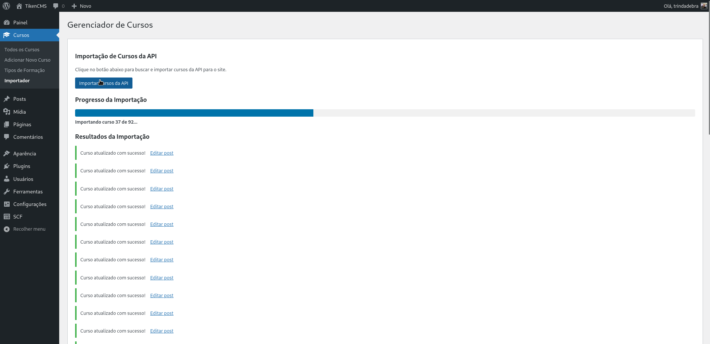
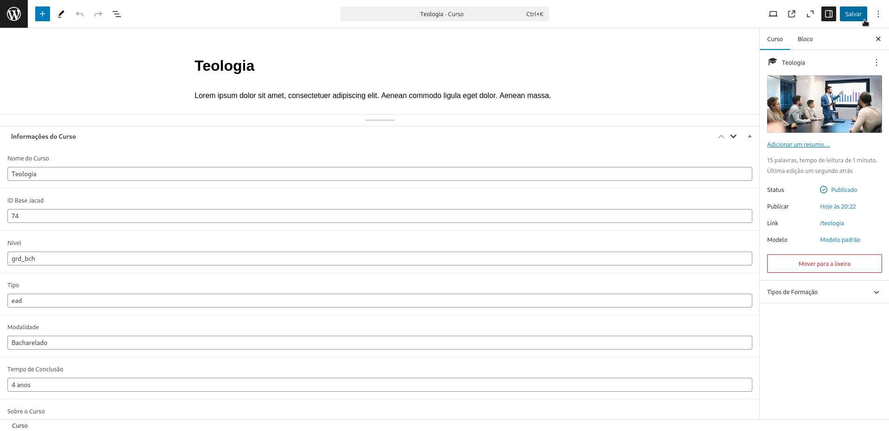
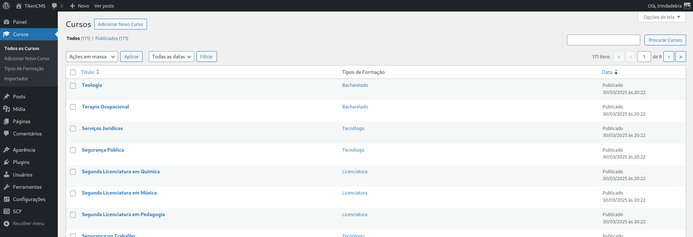
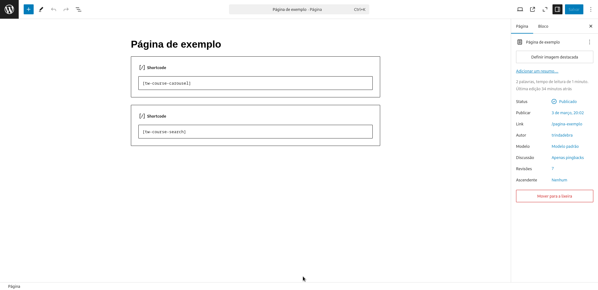
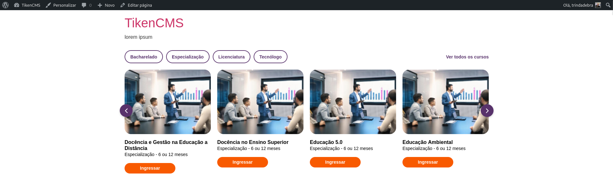
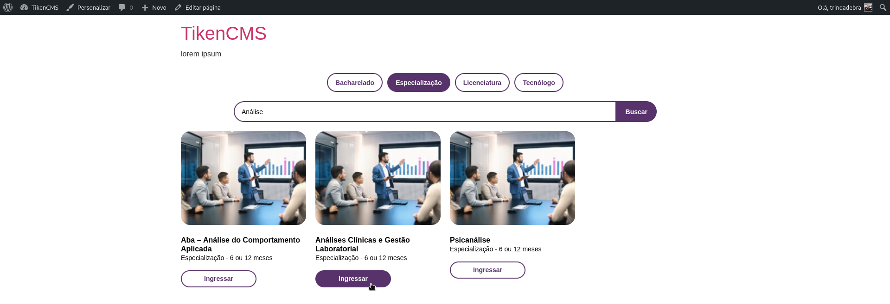

# TW Course Manager

## Visão Geral
O **TW Course Manager** é um plugin WordPress para gerenciamento e exibição de cursos. Ele permite importar cursos automaticamente de uma API externa, organizá-los em um tipo de post personalizado e exibi-los no seu site através de shortcodes.

## Recursos Principais

### Importação de Cursos
- Importação automatizada de cursos via API
- Upload e vinculação automática de imagens em destaque
- Detecção de cursos existentes para evitar duplicações

<div align="center">
  
</div>

### Gerenciamento de Cursos
- Custom Post Type dedicado para cursos
- Taxonomia personalizada para tipos de formação (Bacharelado, Licenciatura, etc.)
- Campos personalizados para detalhes do curso (duração, modalidade, etc.)

<div align="center">
  
</div>

<div align="center">
  
</div>


### Exibição de Cursos
- Shortcode de carrossel para exibição dinâmica de cursos
- Shortcode de pesquisa para filtrar e encontrar cursos
- Filtros por tipo de formação em ambos os shortcodes

## Como Usar

### Shortcodes
Basta adicionar os shortcodes em qualquer lugar do seu site onde você deseja exibir os cursos. Inserir cor de fundo, padding, etc. dentro do container no WordPress/Plugins.

<div align="center">
  
</div>

### Shortcode de Carrossel
```php
[tw-course-carousel]
```
Exibe um carrossel responsivo com os cursos cadastrados, com botões de filtro por tipo de formação.

<div align="center">
  
</div>

### Shortcode de Pesquisa
```php
[tw-course-search]
```
Exibe uma interface de pesquisa com filtros por tipo de formação e campo de busca textual, mostrando os resultados em formato de grade.

<div align="center">
  
</div>

### Importador de Cursos
1. Acesse o menu "Cursos > Importador" no painel administrativo.
2. Clique no botão "Importar Cursos da API".
3. O sistema buscará automaticamente os cursos disponíveis e importará cada um.
4. Uma barra de progresso mostrará o status da importação.
5. Após a conclusão, será exibido um relatório dos cursos importados.

## Campos Personalizados
Cada curso importado contém os seguintes dados:
- Nome do curso
- Modalidade (Presencial, EAD)
- Tipo de formação (Bacharelado, Licenciatura, etc.)
- Tempo de conclusão
- Sobre o curso
- Mercado de trabalho
- Matriz curricular
- Competências e habilidades
- Preços
- Área de conhecimento
- Portaria MEC